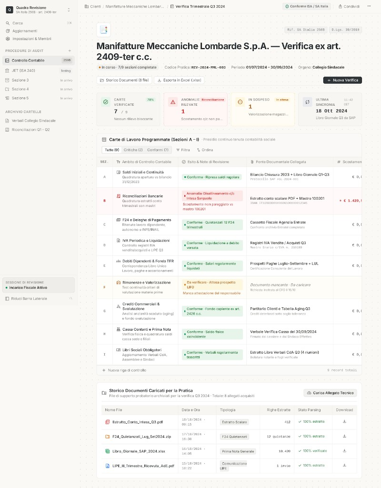

# Quadra

Strumento interno dello studio per la revisione. Due moduli nello stesso prodotto, contesti separati:

1. **JET — Journal Entry Testing** (ISA Italia 240 §A44) — **in lavorazione**, è il filo principale.
2. **Controllo contabile trimestrale** (art. 2409-ter c.c., SA Italia 250B) — **in pausa**.

Non firma, non scrive la conclusione, non decide la materialità: quello resta dell’operatore.

## Stato

| Modulo | Stato | Note |
|--------|--------|------|
| **JET** motore + UI | Attivo | Pratiche, fonti multiple, matrice dei 15, profili TXT/PDF testuale, analisi, export |
| **JET** PDF scansionato (OCR) | In pausa | PaddleOCR non allinea le colonne; non mescolare col JET tabellare |
| **Controllo SA 250B** | **In pausa** | Motore A–I resta nel repo; la dashboard non si evolve finché JET non è chiuso. Il layout di riferimento è sotto |
| Consentil (cyber) | Fuori da questo repo | Dopo Quadra stabile |
| Produzione / Vercel | Non supportato | Serve Python, upload grandi, disco. Locale o VPS + Docker |

### Controllo contabile — in pausa

Il modulo SA 250B (sezioni A–I, carte di lavoro, ingest documenti, export Excel) **non è il lavoro in corso**. Resta avviabile in locale, ma non va esteso né ridisegnato ora.

Riferimento visivo (mock / target, non lo stato live da inseguire in questo sprint):



Quando si riprenderà: classificazione documenti, estrazione campi, stati A–I, dashboard e Excel carte di lavoro. Generalizzazione oltre i YAML pilota (Ferrero, SWGI) resta aperta.

## JET — cosa c’è oggi

Flusso operativo:

1. **Catalogo pratiche** — lista cliente / periodo / stato. Si apre un incarico con un click; «Nuova pratica» è un form a parte.
2. **Workspace incarico** — titolo = cliente, chip di stato, quattro metriche vere (popolazione, scritture sospette, controlli attivi `n/15`, fonti). Niente numeri finti da brochure.
3. **Sorgente libro giornale** — .xlsx, .txt a colonne fisse, .pdf testuale. Tabella fonti, profilo esistente **oppure** nuovo profilo (non i due insieme). Duplicati solo se ci sono due o più file.
4. **Matrice dei 15 controlli** — una tabella, non una pagina per criterio. Click sulla riga per i campi; toggle Acceso/Spento. Pesi Baker Tilly visibili. Se manca un parametro il criterio è **non calcolabile**, mai un falso «ok».
5. **Analisi ed export** — «Avvia analisi» in testa alla pagina; risultati filtrabili ed Excel.

I 15 restano sulla stessa matrice. Non si paginano i controlli.

UI: carta Notion (`code.html` / `ui/src/design/reference.html`), Inter, icone Material Symbols, fondo a puntini **fisso** (non scorre col contenuto). Una sola CTA scura per schermata (`Avvia analisi`).

**Due URL, due cose diverse**

| URL | Cosa vedi |
|-----|-----------|
| [http://127.0.0.1:5173/](http://127.0.0.1:5173/) | Vite, codice in `ui/src`, aggiornamento a caldo |
| [http://127.0.0.1:8000](http://127.0.0.1:8000/) | FastAPI + copia **build** in `ui/dist` (va ricostruita con `cd ui && npm run build`) |

Se l’interfaccia sembra vecchia, stai sul `:8000` con un `dist` datato, oppure la cache del browser. Hard refresh, oppure apri `:5173`. `./start.sh` imposta `QUADRA_DEV=1`: in quel caso `:8000/` non serve l’UI, solo l’API.

### Motore (sintesi)

- Isolato in `backend/jet/` (non importare da `backend/domain/`, non usare il prototipo `backend/modules/jet/`).
- Persistenza SQLite in `storage/` (gitignored).
- Criteri su importo, weekend, festività, orario, retrodatazione, staff, parti correlate, descrizione, rarità conto, infragruppo, sequenza. Non tutti i 15 Caseware sono nel motore: la matrice UI lo dice (Nel motore / Parziale / Assente).
- Fuori scope per ora: JET-11 sequenza bollata, JET-13 ri-analisi sui sospetti, OCR visura, moduli Caseware extra.

Dettaglio: [`docs/jet/00_riferimento_tecnico.md`](docs/jet/00_riferimento_tecnico.md), piano sprint [`docs/jet/piano_sprint_15_controlli_2026-09-10.md`](docs/jet/piano_sprint_15_controlli_2026-09-10.md).

## Avvio in locale

Serve **Python 3.13** e **Node.js**. OCR del controllo (quando si riprenderà): [`docs/OCR.md`](docs/OCR.md).

```bash
chmod +x start.sh
./start.sh
```

- UI live: [http://127.0.0.1:5173/](http://127.0.0.1:5173/)
- API: [http://127.0.0.1:8000](http://127.0.0.1:8000)
- OpenAPI: [http://127.0.0.1:8000/docs](http://127.0.0.1:8000/docs)
- Windows: `start.bat`

`start.sh` crea `.venv-py313`, installa le dipendenze e alza API + Vite.

```bash
# Solo API (serve anche ui/dist se apri :8000 senza Vite)
.venv-py313/bin/python -m uvicorn backend.main:app --reload --host 127.0.0.1 --port 8000

# Solo UI
cd ui && npm run dev

# Aggiornare la copia servita da :8000
cd ui && npm run build
```

Prove senza dati cliente: `fixtures/docs` (controllo, fermo), `fixtures/jet` (JET).

## Architettura

```
UI (React + Vite)     shell + JET (attivo) + Controllo (in pausa)
        │
API FastAPI           /api/jet/*   /api/domain/*   /api/*
        │
┌──────────────────┬─────────────────┬──────────────────┐
│ JET backend/jet  │ Domain SA 250B  │ Pipeline legacy  │
│ pratiche, ingest │ verify/export   │ classify/extract │
│ criteri, store   │ (non toccare)   │                  │
└──────────────────┴─────────────────┴──────────────────┘
        │
JetStore SQLite                  Evidence store controllo
```

`backend/core/` e `backend/enterprise/` sono scaffolding (auth, tenant, Redis) per un eventuale multi-utente: **non è il percorso attuale**.

## API JET (sintesi)

```
POST   /api/jet/pratiche
GET    /api/jet/pratiche
PUT    /api/jet/pratiche/{id}/parametri
POST   /api/jet/pratiche/{id}/files
GET    /api/jet/pratiche/{id}/fonti
PATCH  /api/jet/pratiche/{id}/fonti/{fonte_id}
POST   /api/jet/pratiche/{id}/analizza
GET    /api/jet/pratiche/{id}/risultati
GET    /api/jet/pratiche/{id}/export.xlsx
GET    /api/jet/profili
```

Dettaglio in [http://127.0.0.1:8000/docs](http://127.0.0.1:8000/docs).

## Clienti controllo (quando si riprende)

Config in `backend/domain/clients/*.yaml`: Ferrero, SWGI, Demo. Nuovo cliente = YAML con banche, fondi, soglie e voci catalogo.

## Sezioni A–I (controllo, in pausa)

| | Carta | Verifiche SA 250B |
|---|---|---|
| **A** | Sistema di controllo interno | Organizzazione, procedure |
| **B** | Libri obbligatori | 3, 5, 6, 7 |
| **C** | Adempimenti tributari/previdenziali | 8 |
| **D** | Test rilevazioni / JET | Campione sul giornale |
| **E** | Disponibilità liquide | Banche vs co.ge. |
| **F** | Verbali | 7 |
| **G** | Situazione contabile | 10 |
| **H** | Colloqui Direzione | 9 |
| **I** | Operazioni significative | Giudizio |

| Codice | Significato |
|---|---|
| **✓** | Superata / documento usabile |
| **wip** | Manca evidenza |
| **✗** | Saltato di proposito |
| **N/A** | Non applicabile al cliente |

## Deploy

Non usare Vercel per API + JET + OCR.

- Primi test: questo Mac, `./start.sh`.
- Studio / URL interno: VPS EU + Docker (`docker-compose.yml`). Primo giro senza OCR pesante.
- Dati cliente e file JET reali: solo disco locale o server dello studio. Non finiscono in git (`data/`, `test/`, `storage/` ignorati).

Copia `.env.example` in `.env` per Postgres/Redis/MinIO quando usi Compose.

## Test

```bash
.venv-py313/bin/python -m pytest tests/ -q
.venv-py313/bin/python -m pytest tests/test_jet*.py tests/modules/jet/ -q
```

## Stack

- Backend: FastAPI, Python 3.13
- UI: React + Vite + TypeScript
- JET persistenza: SQLite sotto `storage/`
- OCR controllo: PaddleOCR (locale), non in uso sul JET tabellare
- Opzionale: PostgreSQL, Redis, MinIO (Compose)

## Documentazione

- [Piano operativo](docs/piano_operativo.md)
- [Riferimento tecnico JET](docs/jet/00_riferimento_tecnico.md)
- [Sprint 15 controlli](docs/jet/piano_sprint_15_controlli_2026-09-10.md)
- [Obiettivi SA 250B](docs/analisi_obiettivi_controllo_contabile.md) — modulo in pausa
- [OCR](docs/OCR.md)
- [Design UI JET](ui/design-system/pages/jet.md)
- [Architettura enterprise (futuro)](docs/architecture/ENTERPRISE_ARCHITECTURE.md)
