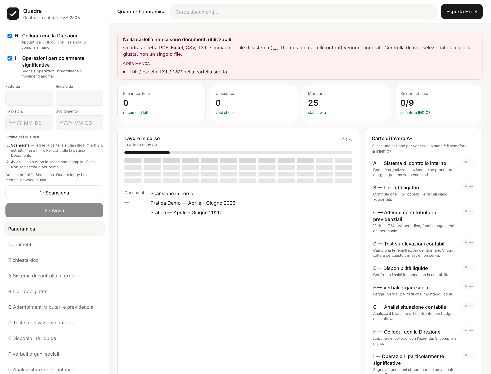

# Quadra — Controllo contabile

Quadra aiuta a compilare il **working paper set** del controllo contabile trimestrale (art. 2409-ter c.c., principio **SA Italia 250B**).

Analizza la cartella documenti del cliente, classifica i file (F24, estratti conto, mastrini, verbali, IVA…), **verifica le 12 aree del principio SA 250B** e produce una dashboard con stato, evidenze e fonti — più l'export Excel in formato carte di lavoro **A–I**.



## Cosa fa

1. **Classifica** i documenti del cliente (F24, estratti conto, verbali, libri…)
2. **Estrae** automaticamente i campi rilevanti (date, importi, saldi, protocolli)
3. **Verifica** le 12 aree del principio SA 250B con evidenze e fonti
4. **Dashboard** nativa con stato di ogni verifica (`✓`, `wip`, `✗`, `N/A`)
5. **Export Excel** compatibile con il template A–I esistente
6. **Tracciabilità** completa: ogni dato è collegato al documento di origine

Non firma, non scrive la conclusione, non decide la materialità: quello resta dell'operatore.

## Architettura

Il sistema è organizzato in livelli separati:

```
┌─────────────────────────────────────────────────────────┐
│                    UI (React + Vite)                    │
│              Dashboard verifiche + Legacy               │
├─────────────────────────────────────────────────────────┤
│                      API (FastAPI)                      │
│              /api/domain/* + /api/*                     │
├─────────────────────────────────────────────────────────┤
│  Motore di Verifica │ Excel Renderer │ Client Config   │
│  (verification_     │ (excel_        │ (clients/*.yaml)│
│   engine.py)        │  renderer.py)  │                 │
├─────────────────────────────────────────────────────────┤
│            Evidence Store (store.py)                    │
│    Documenti + Fatti estratti + Findings aperti         │
├─────────────────────────────────────────────────────────┤
│     Ingestion (classify.py + ingest_adapter.py)         │
│           Classificazione + Estrazione                  │
└─────────────────────────────────────────────────────────┘
```

- **Ingestion**: classifica i file e ne estrae i dati strutturati (date, importi, saldi)
- **Evidence Store**: persiste documenti, evidenze estratte e findings
- **Motore di Verifica**: applica le regole SA 250B e produce stato + motivazione per area
- **Client Config**: configurazione per cliente (banche, fondi, voci catalogo)
- **Excel Renderer**: esporta i risultati nel formato Excel tradizionale

## Avvio in locale

Serve **Python 3.13**, **Node.js** e, per l'OCR, PaddlePaddle (vedi [docs/OCR.md](docs/OCR.md)).

```bash
chmod +x start.sh
./start.sh
```

Poi apri [http://127.0.0.1:5173/](http://127.0.0.1:5173/).

- API: `http://127.0.0.1:8000`
- API Docs: `http://127.0.0.1:8000/docs`
- Su Windows: `start.bat`

`start.sh` crea l'ambiente `.venv-py313`, installa le dipendenze e alza API + interfaccia.

### Avvio manuale

```bash
# Backend
.venv-py313/bin/python -m uvicorn backend.main:app --reload --port 8000

# Frontend (in altra shell)
cd ui && npm run dev
```

Cartella di prova (sintetica, senza dati cliente): `fixtures/docs`.

## Clienti configurati

La configurazione per cliente è in `backend/domain/clients/*.yaml`:

| Cliente | File | Note |
|---------|------|------|
| Ferrero | `ferrero.yaml` | Cliente di riferimento, configurazione completa |
| SWGI | `swgi.yaml` | Secondo cliente onboardato |
| Demo | `demo.yaml` | Per test e sviluppo |

Per aggiungere un nuovo cliente: crea un file YAML nella cartella `clients/` con anagrafica banche, fondi previdenziali, soglie di materialità e voci catalogo applicabili.

## Sezioni A–I

Ogni lettera è una carta del controllo, corrispondente a una o più verifiche SA 250B.

| | Carta | Verifiche SA 250B |
|---|---|---|
| **A** | Sistema di controllo interno | Organizzazione, procedure, cambiamenti |
| **B** | Libri obbligatori | Esistenza, vidimazione, aggiornamento (verifiche 3, 5, 6, 7) |
| **C** | Adempimenti tributari/previdenziali | F24, LIPE, fondi, contributi (verifica 8) |
| **D** | Test rilevazioni contabili | Campione sul giornale |
| **E** | Disponibilità liquide | Riconciliazione banche, saldi e/c vs co.ge. |
| **F** | Verbali organi sociali | Assemblee, CdA, Collegio sindacale (verifica 7) |
| **G** | Analisi situazione contabile | Bilancino, variazioni significative (verifica 10) |
| **H** | Colloqui con la Direzione | Notizie non documentali (verifica 9) |
| **I** | Operazioni significative | Straordinarie, anomalie |

## Stati

| Codice | Significato |
|---|---|
| **✓** | Verifica superata / documento trovato e usabile |
| **wip** | In lavorazione / manca evidenza |
| **✗** | Controllo saltato di proposito |
| **N/A** | Non applicabile per questo cliente |

## API Domain

Le nuove API per il motore di verifica:

```
GET  /api/domain/workspaces              # Lista workspace
POST /api/domain/workspaces              # Crea workspace
GET  /api/domain/workspaces/{id}         # Dettaglio + stato verifiche
POST /api/domain/workspaces/{id}/ingest  # Carica documenti
POST /api/domain/workspaces/{id}/verify  # Esegue verifiche
GET  /api/domain/workspaces/{id}/export  # Export Excel
```

## Cosa produce

Nella cartella di output della pratica:

- **Dashboard** con stato delle 12 verifiche, evidenze e fonti
- **Excel compilato** (copia del master, formato carte A–I)
- `mancanti.md` — documenti non trovati
- `provenienza.jsonl` — tracciabilità cella → documento origine

## Test

```bash
# Tutti i test
.venv-py313/bin/pytest

# Solo test del domain (motore di verifica)
.venv-py313/bin/pytest tests/test_domain_*.py -v
```

## Stack

- **Backend**: FastAPI (`backend/`)
  - Domain engine: `backend/domain/`
  - Classificazione: `backend/classify.py`
  - Estrazione: `backend/extract.py`
- **UI**: React + Vite (`ui/`)
  - Dashboard verifiche: `ui/src/domain/`
- **Configurazione**: 
  - Regole template: [`regole/TEMPLATE_RULES.md`](regole/TEMPLATE_RULES.md)
  - Schema: [`regole/schema.yaml`](regole/schema.yaml)
  - Clienti: `backend/domain/clients/*.yaml`
- **OCR locale**: [docs/OCR.md](docs/OCR.md)

## Documentazione

- [Analisi obiettivi controllo contabile](docs/analisi_obiettivi_controllo_contabile.md)
- [Piano redesign](docs/piano_azione_redesign.md)
- [Prompts e reviews fasi 0-9](docs/prompts/)
